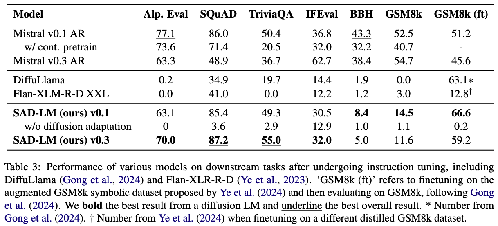

# TESS 2: A Large-Scale, Generalist Diffusion Language Model

[](https://arxiv.org/abs/tidi)
[](https://huggingface.co/collections/hamishivi/tess-2-677ea36894e38f96dfc7b590)

This is the codebase for the paper [TESS 2](https://arxiv.todo). TESS 2 is a state-of-the-art diffusion language model created by adapting existing pretrained autoregressive models to a diffusion paradigm.
For more details, please check out [our paper](ttps://arxiv.todo)!



We note this codebase is based off and is very indebted to [the original TESS codebase](https://github.com/allenai/tess-diffusion).

You can find the models associated with the paper and this codebase [here](https://huggingface.co/collections/hamishivi/tess-2-677ea36894e38f96dfc7b590).

## Installation

```sh
conda env create -n simplex -f environment.yml
pip install -r requirements.txt
```

## Diffusion Adaptation Training

The first step in training TESS 2 is diffusion adaptation training. Simply run:

```sh
shell_scripts/run_pretrain.sh
```

Feel free to edit arguments in the script, such as switching out the base model.

Additionally, you will need to download Dolma 1.7 and point to it during training. Please follow the download instructions on the [Dolma page](https://huggingface.co/datasets/allenai/dolma#download) and then edit line 60 of `sdlm/data/dolma/dolma_dataset.py` accordingly:
```diff
-    "/data/input/lucas/ai2-llm/pretraining-data/sources/olmo-mix/danyh-compiled-v1_7"
+    "<your data path here>
```

Alternatively, you can use a subset of Dolma 1.7 such as those hosted [here](https://huggingface.co/datasets/emozilla/dolma-v1_7-305B) by setting the `dataset_name` flag:
```sh
--dataset_name emozilla/dolma-v1_7-305B \
--streaming \
```

This shouldn't yield big changes in performance since we only use roughly 45B tokens for diffusion adaptation training (and the linked dataset contains 305B tokens).
Note we assume access to a node with 8 80GB GPUs (A100 or H100) for this script.

## Instruction Tuning

Given this, we can then instruction tune with the following:
```sh
export OPENAI_API_KEY=<your openai key>
export IS_ALPACA_EVAL_2=False
shell_scripts/run_tulu.sh
```

Edit the `model_name_or_path` argument to load specific pretrained models:
```diff
- --model_name_or_path tulu_mistral_diffusion_200k \
+ --model_name_or_path <your model path here> \
```

The API key is used to run AlpacaEval throughout training. Remove the `--do_eval` flag to avoid running this.

You can change the training set with the `--dataset_name` flag. For example, to train on the symbolic GSM8k data used for training our GSM8k-specific model, use `--dataset_name hamishivi/gsm8k-symbolic`.

## Evaluation

Finally, to evaluate the model run:
```sh
shell_scripts/run_tulu_eval.sh <run name> <model path> <eval name>
```

Valid evaluation names are: `alpaca_eval`, `gsm8k`, `human_eval`, `bbh`, `squad`, `triviaqa`, `ifeval`, `mmlu`. Note that Squad, TriviaQA, IFEval, GSM8k, AlpacaEval, BBH are the most tested.

## Guidance

To run inference with reward guidance, use:
```sh
shell_scripts/run_guidance.sh <model path> <reward model path> <guidance scale> <eval name>
```

This should work with any evaluation stated above, although we primarily tested with AlpacaEval.
For example, to run with the released TESS-2 model and associated reward model, use:
```sh
export OPENAI_API_KEY=<your openai key>
export IS_ALPACA_EVAL_2=False
shell_scripts/run_guidance.sh hamishivi/tess2 hamishivi/tess_mistral_rm 0.5 alpaca_eval
```

## Beaker (For people at Ai2)

For all the above scripts, you can run them with gantry by setting `BEAKER` and `WEKA` before running, e.g.:
```sh
BEAKER=1 WEKA=1 shell_scripts/run_pretrain.sh
```

## Demo

We also provide a gradio demo for interacting with the model, which you can run with the following command:

```sh
./shell_scripts/run_interactive_demo.sh <path to model>
```

This gives a gradio UI that you can use to interact with the model as shown below:


As you can see, the UI shows the highest confidence tokens at intermediate diffusion steps as the model generates them, providing a rough idea of the diffusion process.

## Other Scripts

We also have scripts for computing perplexity, confidence over steps, and AR training in the `shell_scripts` folder.
These largely use similar commands and setups to the scripts above, but please feel free to leave an issue or email Hamish Ivison (hamishiv at cs.washington.edu) if you need further assistance.
